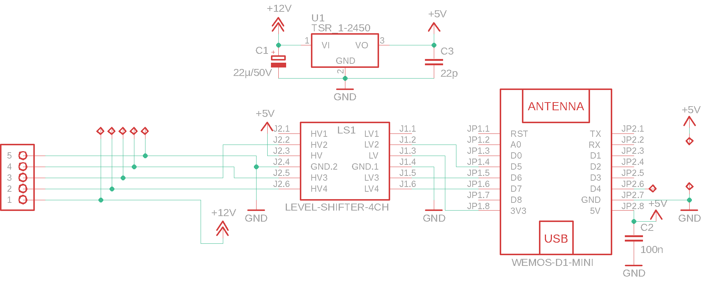
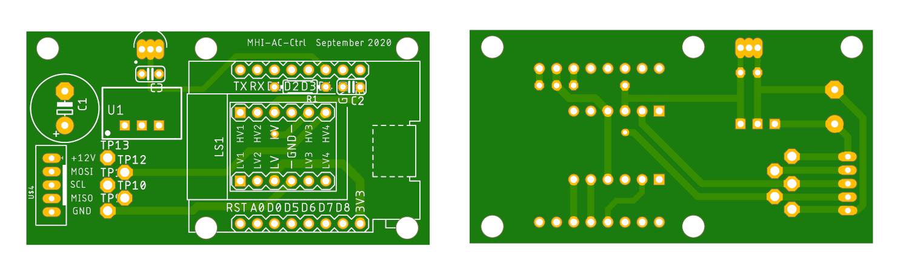
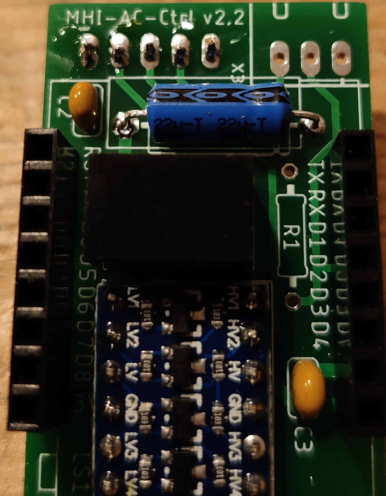
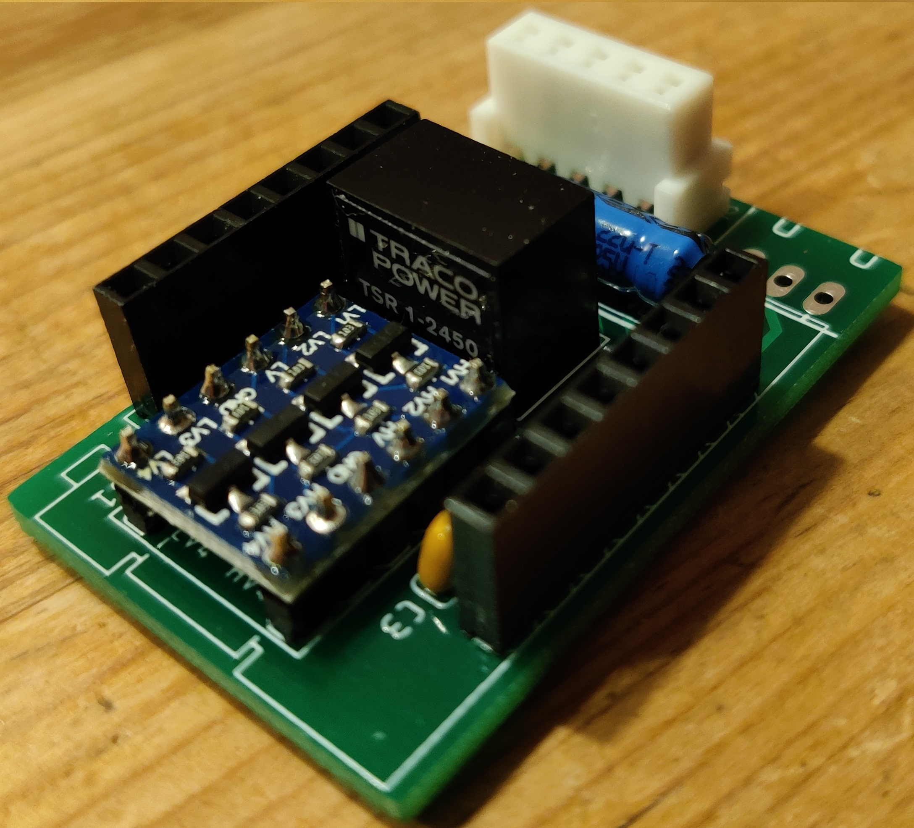
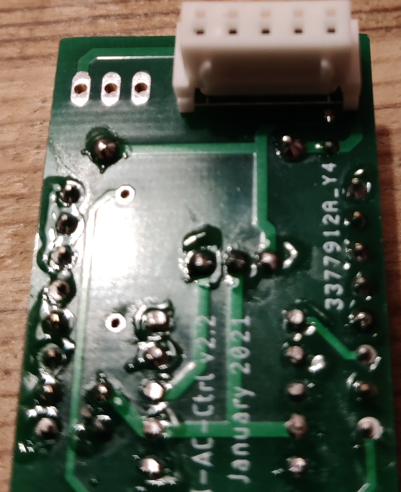
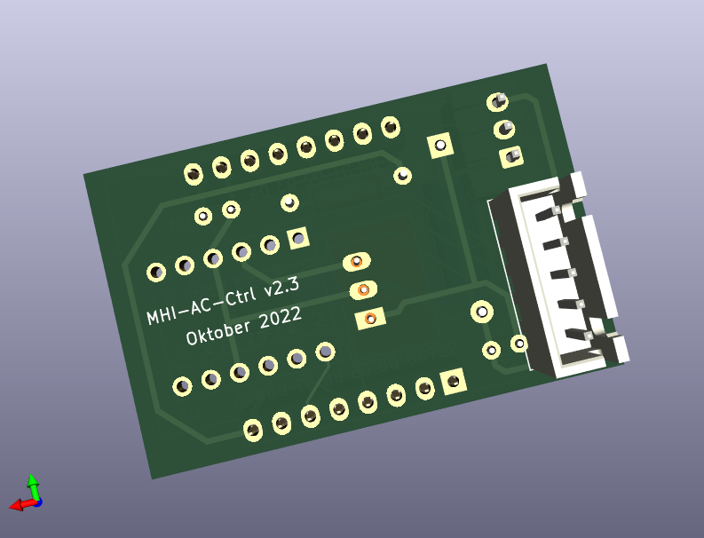
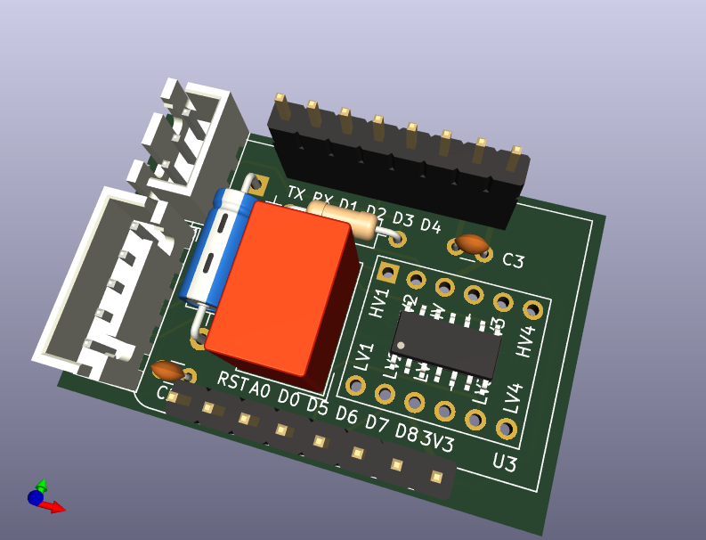
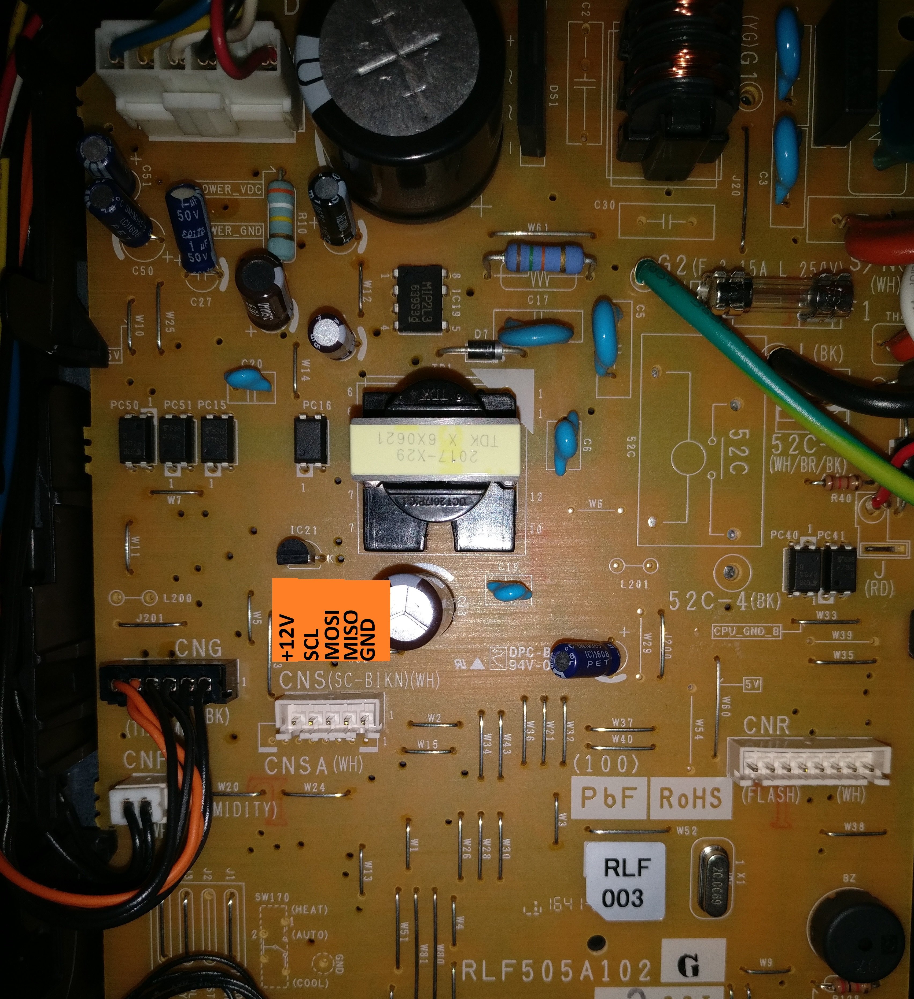
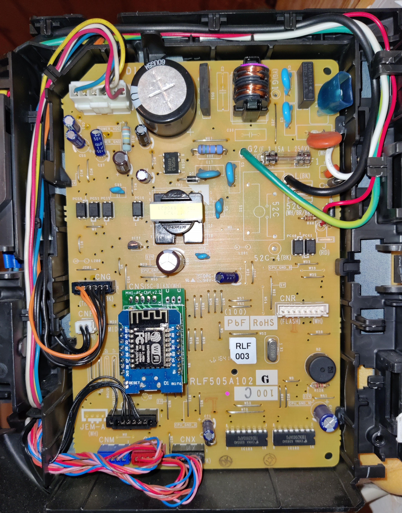
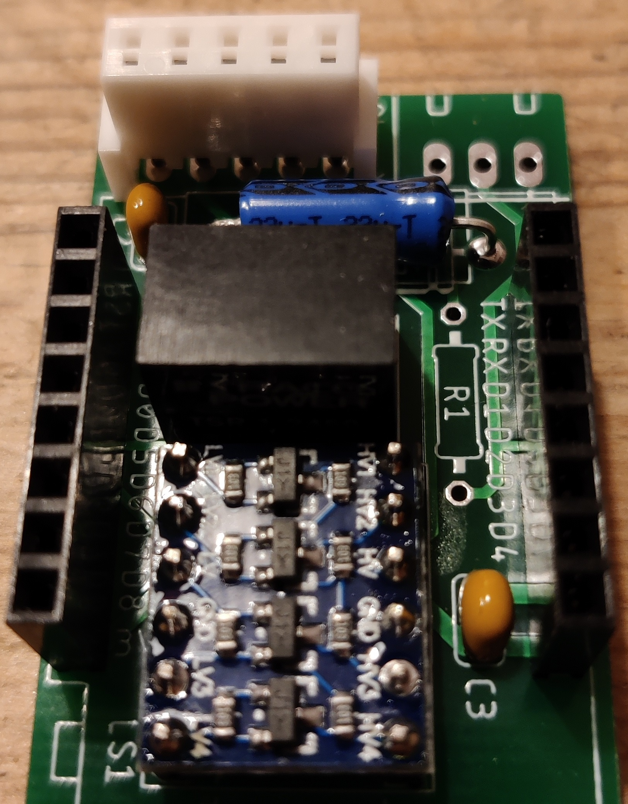

# Hardware

## Schematic

## PCB (Eagle)

You find the eagle schematic and the layout in the [eagle folder](eagle). The Gerber data is in [MHI-AC-Ctrl_v2.2_2021-01-22.zip](eagle/Gerber/MHI-AC-Ctrl_v2.2_2021-01-22.zip). I used this Gerber data for the PCB order at [JLCPCB](https://jlcpcb.com).

## Bill of Material
Part |Value            |Package                    |comment
---- | ----            |----                       |-----
C1   |22µ/25V          |E15-5                      |consider the polarity
C2, C3   |100n             |C025-024X044
LS1  |LEVEL-SHIFTER-4CH|LEVEL-SHIFTER-4CH          |consider the polarity
U$1  |WEMOS-D1-MINI    |WEMOS-D1-MINI              |consider the polarity
U1   |TSR_1-2450       |TSR-1                      |consider the polarity  1
X1   |JST 05JQ-BT      |JST-XH-05-PACKAGE-LONG-PAD                     |consider the polarity

1According to the discussions [here](https://github.com/absalom-muc/MHI-AC-Ctrl/issues/102) and [here](https://github.com/absalom-muc/MHI-AC-Ctrl/issues/17) TSR 1-2450 can be replaced by TSR 1-2450E.

The following parts are only needed when externally a DS18x20 should be connected:
Part |Value            |Package                    |comment
---- | ----            |----                       |-----
R1   |4k7              |R-EU_0207/10       
X3   |JST-XH-03        |JST-XH-03-PACKAGE-LONG-PAD |consider the polarity

## Assembled PCB
The following photos show the assembled PCB (without R1 and X1, which are used in context of DS18x20 only).

# PCB (KiCad)
User [oliv3r](https://github.com/oliv3r) converted the eagle model to KiCad, see [here](kicad).   

   
Please note that the KiCad design hasn't been tested so far (see also this [issue](https://github.com/absalom-muc/MHI-AC-Ctrl/issues/111)).

## Connector
The AC provides the signals via the CNS connector. It has 5 pins with a pitch of 2.5 mm. It is out of the [XH series from JST](http://www.jst-mfg.com/product/detail_e.php?series=277). The position of the connector is visible on the following photo of the AC indoor unit PCB.

The PCB of the remote control uses a pin connector out of [JST JQ series](https://jst.de/file/download/124/pitch-2-5-mm-btb-jq-pdf) also with a pitch of 2.5 mm. So the board can be directly plugged into the board of the AC.

 

*hint: For previous MHI-AC-Ctrl PCB layouts a different connector was used. Additionally, it was required to swap pins because there was no 1:1 connection. This is no longer valid for the latest PCB layout. With the latest PCB layout you can directly plug the MHI-AC-Ctrl PCB to the AC PCB - **:warning: of course only when the AC is de-energized :warning:**.*

The possibility to directly plug the MHI-AC-Ctrl PCB to the AC PCB makes it simpler, but the operation of MHI-AC-Ctrl inside the AC case could reduce slightly the WiFi signal strength. If you see that the signal strength is not sufficient (e.g. many WiFi disconnects) then you should use a cable (called "4S balancer JST-XH extension cable" with one male and one female connector) and locate MHI-AC-Ctrl outside of the AC case. 

:warning: **Opening of the indoor unit should be done by a qualified professional because faulty handling may cause leakage of water, electric shock or fire!** :warning:

Before you assemble the PCB, please check this [issue](https://github.com/absalom-muc/MHI-AC-Ctrl/issues/56). For some ACs (e.g. SRK-ZSX serie) it's getting tight and there might be not enough space to plug-in the MHI-AC-Ctrl PCB to your AC board.

## Power Supply
The JST connector provides +12V. The DC-DC converter [TSR 1-2450](https://www.tracopower.com/products/browse-by-category/find/tsr-1/3/) converts the +12V to +5V.

## Signal Connection
The ESP8266 SPI signals SCL (SPI clock), MOSI (Master Out Slave In) and MISO (Master In Slave Out) are connected via a voltage level shifter 5V <-> 3.3V with the AC. Direct connection of the signals without a level shifter could damage your ESP8266!
In an early version I used a resistor voltage divider, but since the SPI of the AC has high impedance outputs, a voltage level shifter seems to be better. The voltage level shifters are bi-directional. That means the according ESP8266 pins (SCL, MOSI, MISO) could be inputs or outputs.

Please find [here](https://github.com/absalom-muc/MHI-AC-Ctrl/issues/65) the discussion if the level shifter can be omitted. 

## External Temperature Sensor
An external temperature sensor DS18x20 (e.g. DS18S20, DS18B20) is supported. If you want to connect a DS18x20 you assemble R1 (4k7) on the PCB. The signals for the DS18x20 are available at X2.

## Hints for Assembly
If you prefer to assemble X1 on the top of the PCB because e.g. you want to place the MHI-AC-Ctrl outside of the AC, you have to consider the direction of X1 as shown on the following photo.

## ESP32
There is also an ESP32 variant available created by user [hberntsen](https://github.com/hberntsen/mhi-ac-ctrl-esp32-c3). It is a rewite of the core files and using esphome. Issues with it should be posted there :-) 
